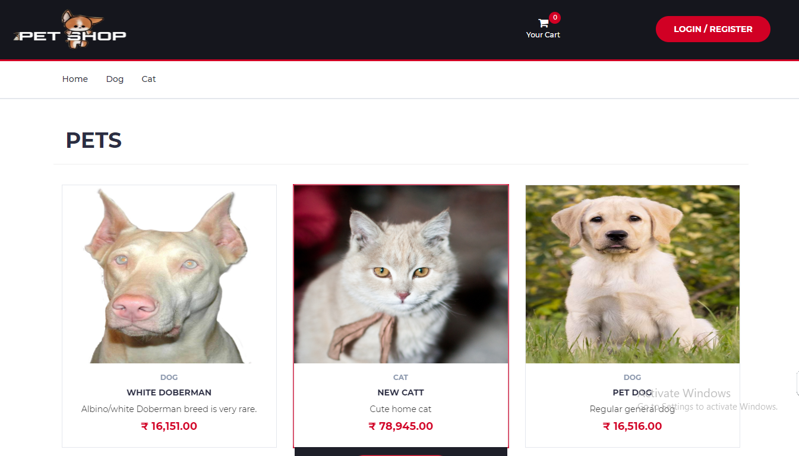
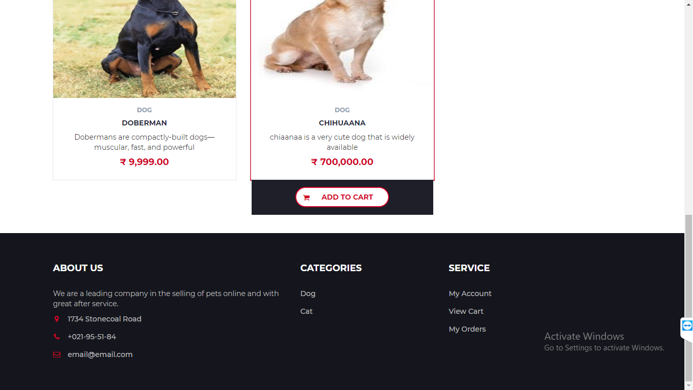
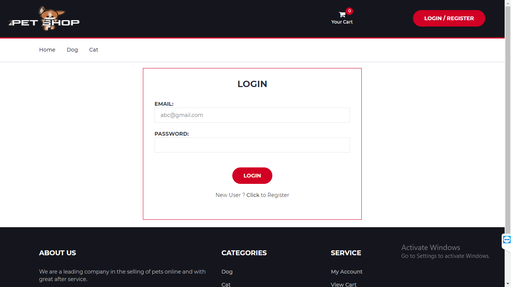
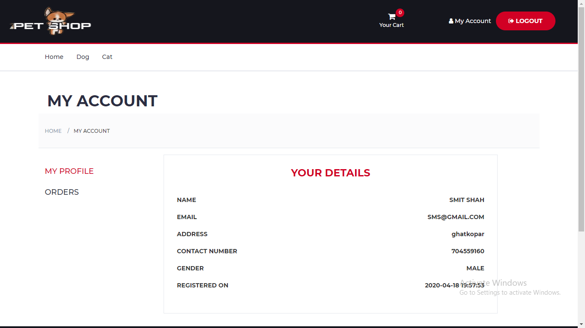
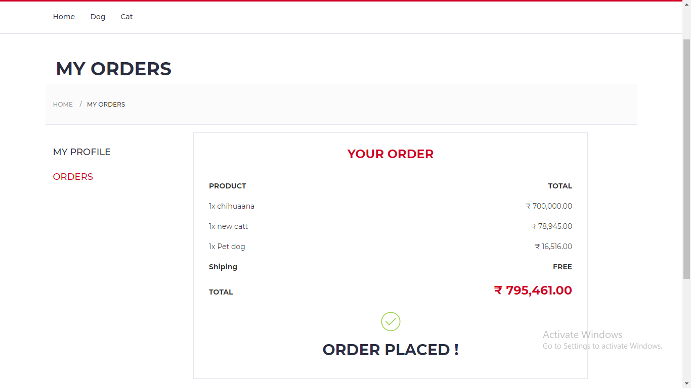
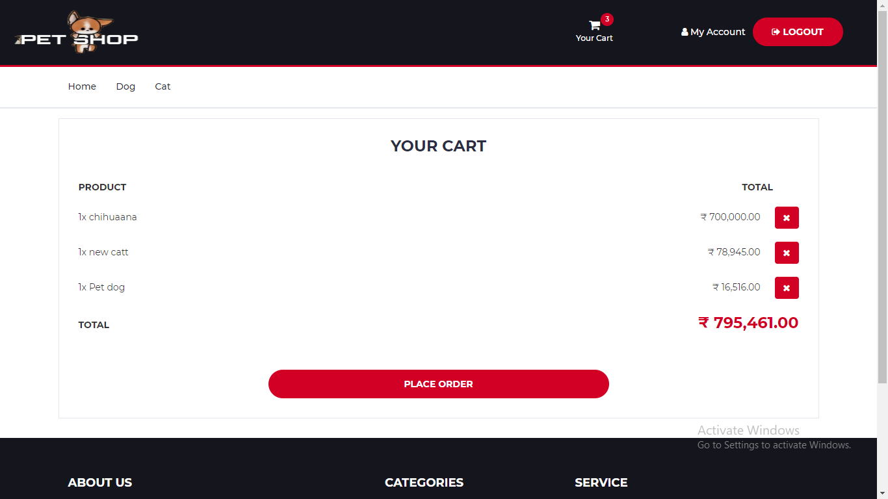
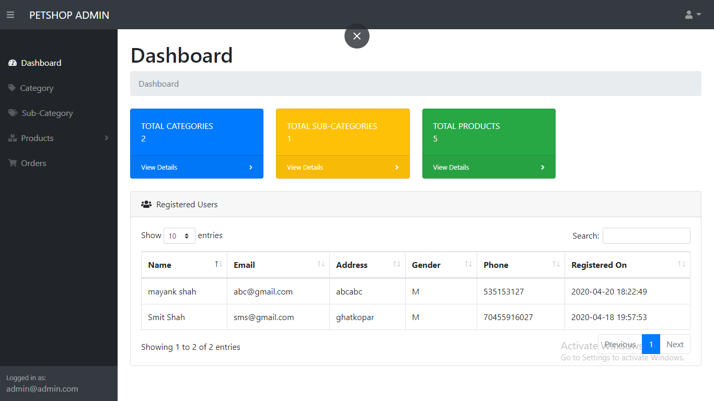
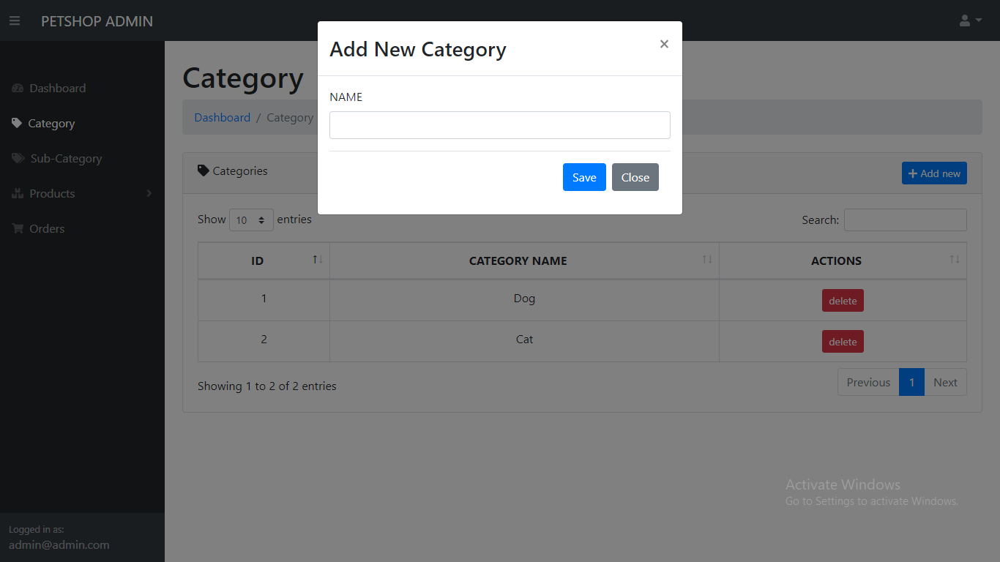

# PETSHOP 

Petshop is an online pet management e-commerce web application. The users can view various pets up for sale and can add to cart and checkout. Admin can manage the orders and the pets.

### It has many functionalites:

* Admin panel for management of pets and categories and orders.

* Cart functionality.

* Elegant functionalities.

* .sql file also provided.

### Screenshots:

Home Pages:

Login Page:

My Account:

Orders:

Cart:

Admin Dashboard:

Add New Category:

